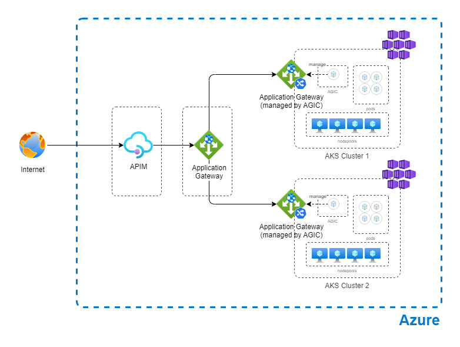

# Configure Azure Kubernetes Service (AKS) in multi cluster envoronment, with AGIC (Application Gateway Infress Controller) with basic networking

This LAB shows you how to set up for demo proposes a environment for multicluster AKS, using an Application Gateway for balance between AKS clusters, using an APIM (API Management) in front.
This scenario uses CNI with AGIC (Application Gateway Infress Controller), with basic networking (working with public ip, not recomended for production environments)

# Architecture diagram



## Prerequisites

- An Azure account with an active subscription. [Create an account for free](https://azure.microsoft.com/free/?WT.mc_id=A261C142F).

---

## Create Environment

Set up the Resource Group

```bash
az group create \
    --name aks-multi-b-rg \
    --location brazilsouth
```
Create Cluster 01

```bash
# Create AKS 01
az aks create -n aks-agic01 -g aks-multi-b-rg --network-plugin azure --enable-managed-identity -a ingress-appgw --appgw-name agic01 --appgw-subnet-cidr "10.225.0.0/16" --generate-ssh-keys

# Get application gateway id from AKS addon profile
appGatewayId=$(az aks show -n aks-agic01 -g aks-multi-b-rg -o tsv --query "addonProfiles.ingressApplicationGateway.config.effectiveApplicationGatewayId")

# Get Application Gateway subnet id
appGatewaySubnetId=$(az network application-gateway show --ids $appGatewayId -o tsv --query "gatewayIPConfigurations[0].subnet.id")

# Get AGIC addon identity
agicAddonIdentity=$(az aks show -n aks-agic01 -g aks-multi-b-rg -o tsv --query "addonProfiles.ingressApplicationGateway.identity.clientId")

# Assign network contributor role to AGIC addon identity to subnet that contains the Application Gateway
az role assignment create --assignee $agicAddonIdentity --scope $appGatewaySubnetId --role "Network Contributor"

```
Create Cluster 02

```bash
# Create AKS 02
az aks create -n aks-agic02 -g aks-multi-b-rg --network-plugin azure --enable-managed-identity -a ingress-appgw --appgw-name agic02 --appgw-subnet-cidr "10.225.0.0/16" --generate-ssh-keys

# Get application gateway id from AKS addon profile
appGatewayId=$(az aks show -n aks-agic02 -g aks-multi-b-rg -o tsv --query "addonProfiles.ingressApplicationGateway.config.effectiveApplicationGatewayId")

# Get Application Gateway subnet id
appGatewaySubnetId=$(az network application-gateway show --ids $appGatewayId -o tsv --query "gatewayIPConfigurations[0].subnet.id")

# Get AGIC addon identity
agicAddonIdentity=$(az aks show -n aks-agic02 -g aks-multi-b-rg -o tsv --query "addonProfiles.ingressApplicationGateway.identity.clientId")

# Assign network contributor role to AGIC addon identity to subnet that contains the Application Gateway
az role assignment create --assignee $agicAddonIdentity --scope $appGatewaySubnetId --role "Network Contributor"
```

Deploy App to test

```bash
az aks get-credentials -n aks-agic01 -g aks-multi-b-rg
kubectl apply -f https://raw.githubusercontent.com/Azure/application-gateway-kubernetes-ingress/master/docs/examples/aspnetapp.yaml

az aks get-credentials -n aks-agic02 -g aks-multi-b-rg
kubectl apply -f https://raw.githubusercontent.com/Azure/application-gateway-kubernetes-ingress/master/docs/examples/aspnetapp.yaml

```
---


Create Application Gateway

```bash

#create vnet
az network vnet create --name agic-vnet --resource-group aks-multi-b-rg --location brazilsouth --address-prefix 10.21.0.0/16 --subnet-name appgtwsubnet --subnet-prefix 10.21.0.0/24

#create public ip
az network public-ip create --resource-group aks-multi-b-rg --name appgtw-pip --allocation-method Static --sku Standard

#create Application Gateway
az network application-gateway create --name appgtw --location brazilsouth --resource-group aks-multi-b-rg --capacity 2 --sku Standard_v2 --public-ip-address appgtw-pip --vnet-name agic-vnet --subnet appgtwsubnet --priority 100

#get AKSs Ingress IPs

#AKS01
az aks get-credentials -n aks-agic01 -g aks-multi-b-rg
kubectl get ingress

#AKS01
az aks get-credentials -n aks-agic02 -g aks-multi-b-rg
kubectl get ingress

```

Create API Management

```bash

let "randomId=$RANDOM"
az apim create --name "apim$randomId" --resource-group aks-multi-b-rg --publisher-name Contoso --publisher-email admin@contoso.com --no-wait 

```
## Next steps


