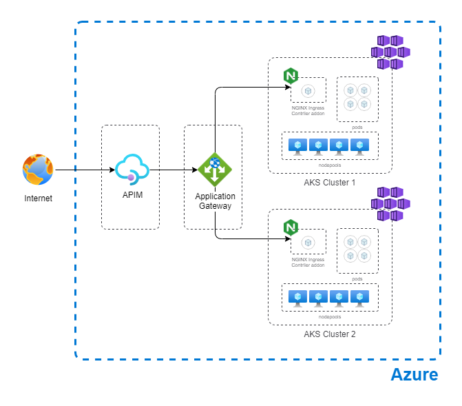

# Configure Azure Kubernetes Service (AKS) in multi cluster envoronment, with kubnet with basic networking

This LAB shows you how to set up for demo proposes a environment for multicluster AKS, using an Application Gateway for balance between AKS clusters, using an APIM (API Management) in front.
This scenario uses kubnet, with basic networking (working with public ip, not recomended for production environments)

# Architecture diagram



## Prerequisites

- An Azure account with an active subscription. [Create an account for free](https://azure.microsoft.com/free/?WT.mc_id=A261C142F).

---

## Configure networking

Set up the virtual networking for the environment

```bash
az group create \
    --name aks-multi-b-rg \
    --location brazilsouth
```
Create Cluster 01

```bash
# Create AKS 01
az aks create --resource-group aks-multi-b-rg --name aks-kuben01 --enable-managed-identity --node-count 1 --generate-ssh-keys

az aks approuting enable -g aks-multi-b-rg -n aks-kuben01

```
Create Cluster 02

```bash
# Create AKS 02
az aks create --resource-group aks-multi-b-rg --name aks-kuben02 --enable-managed-identity --node-count 1 --generate-ssh-keys

az aks approuting enable -g aks-multi-b-rg -n aks-kuben02

```


Deploy App to test

```bash
#Cluster 01

#credentials
az aks get-credentials -n aks-kuben01 -g aks-multi-b-rg

#namespace
kubectl create namespace hello-web-app-routing

#Deployment
kubectl apply -f https://raw.githubusercontent.com/marcosoikawa/Labs/main/aks-multicluster-kubnet/deployment01.yaml -n hello-web-app-routing

#service
kubectl apply -f https://raw.githubusercontent.com/marcosoikawa/Labs/main/aks-multicluster-kubnet/service.yaml -n hello-web-app-routing

#ingress
kubectl apply -f https://raw.githubusercontent.com/marcosoikawa/Labs/main/aks-multicluster-kubnet/ingress.yaml -n hello-web-app-routing

#verify
kubectl get ingress -n hello-web-app-routing


#Cluster 02

#credentials
az aks get-credentials -n aks-kuben02 -g aks-multi-b-rg

#namespace
kubectl create namespace hello-web-app-routing

#Deployment
kubectl apply -f https://raw.githubusercontent.com/marcosoikawa/Labs/main/aks-multicluster-kubnet/deployment02.yaml -n hello-web-app-routing

#service
kubectl apply -f https://raw.githubusercontent.com/marcosoikawa/Labs/main/aks-multicluster-kubnet/service.yaml -n hello-web-app-routing

#ingress
kubectl apply -f https://raw.githubusercontent.com/marcosoikawa/Labs/main/aks-multicluster-kubnet/ingress.yaml -n hello-web-app-routing

#verify
kubectl get ingress -n hello-web-app-routing

```
---


Create Application Gateway

```bash

#create vnet
az network vnet create --name kuben-vnet --resource-group aks-multi-b-rg --location brazilsouth --address-prefix 10.22.0.0/16 --subnet-name appgtwsubnet --subnet-prefix 10.22.0.0/24

#create public ip
az network public-ip create --resource-group aks-multi-b-rg --name kubenappgtw-pip --allocation-method Static --sku Standard

#create Application Gateway
az network application-gateway create --name kuben-appgtw --location brazilsouth --resource-group aks-multi-b-rg --capacity 2 --sku Standard_v2 --public-ip-address kubenappgtw-pip --vnet-name kuben-vnet --subnet appgtwsubnet --priority 100

#get AKSs Ingress IPs

#AKS01
az aks get-credentials -n aks-kuben01 -g aks-multi-b-rg
kubectl get ingress

#AKS01
az aks get-credentials -n aks-kuben02 -g aks-multi-b-rg
kubectl get ingress

```

Create API Management

```bash

let "randomId=$RANDOM"
az apim create --name "apim$randomId" --resource-group aks-multi-b-rg --publisher-name Contoso --publisher-email admin@contoso.com --no-wait

```
## Next steps


